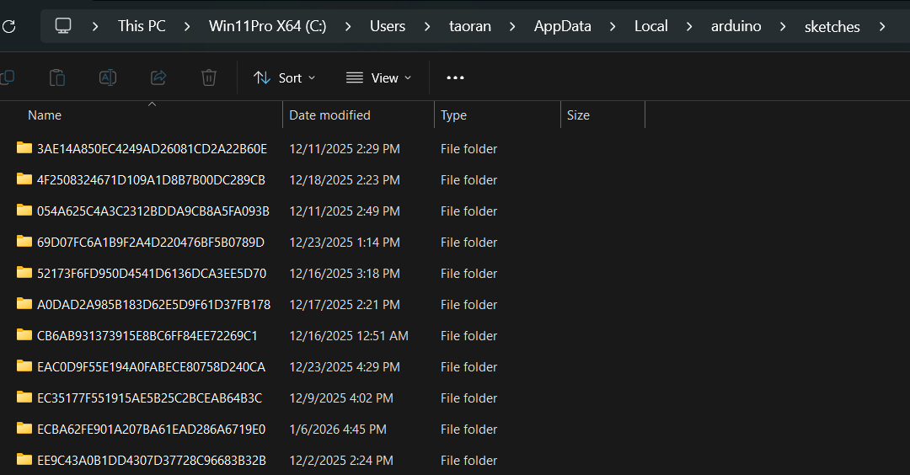
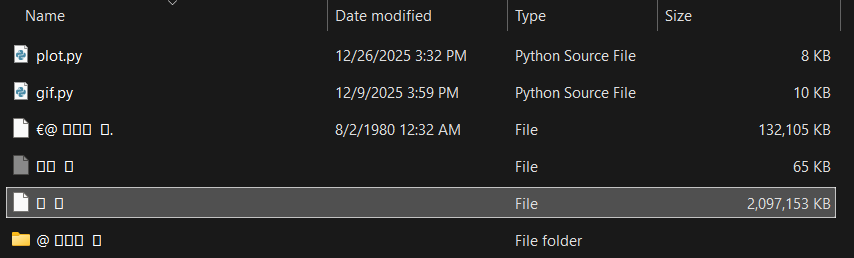
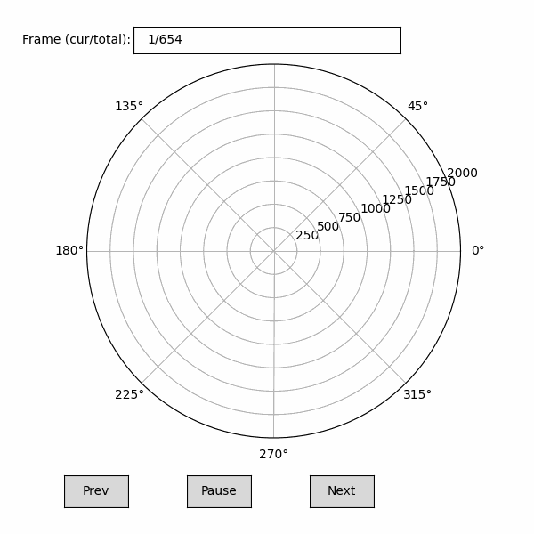
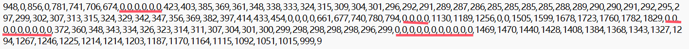
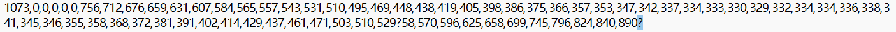
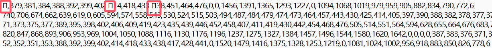
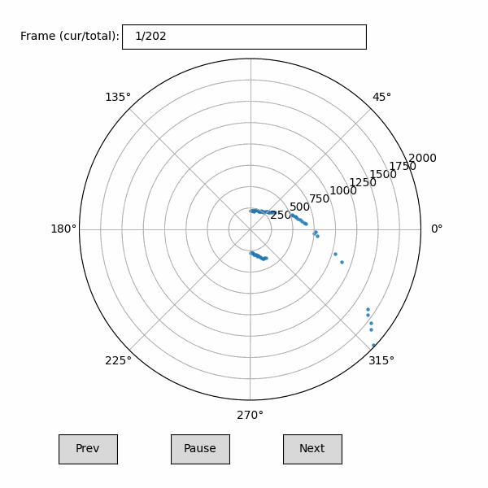
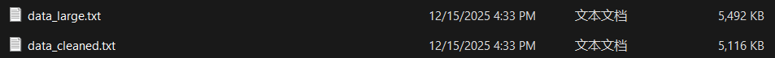
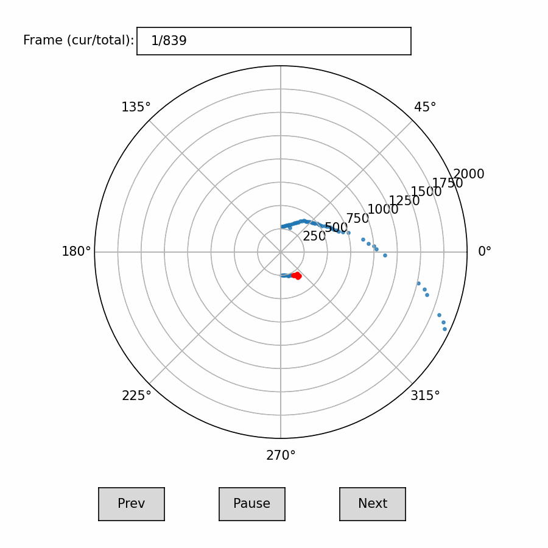

# **AI\_car**

*a self-driving car project based on AI model*

author ： TAO RAN


### **note**：

1. when compilation wrong in ardunio, try remove C\\...\\AppData\\Local\\arduino\\sketches files, this may make recompile successful.

2. if you cannot store file into SD card or the file you stored is always damaged, scan your SD card's file first, if there is any damaged file like with data 2049 or the size is extremely large like 2438,5674,4389KB, then delete this file. Any damaged file inside your SD card will very likely to lead to the above situation


##
version v1.0.0

the whole program is divided into 3 main parts : 
* **part1**: build the car and run program (bluetooth control, Lidar scan and SD store )
* **part2**: train the car through App on the phone
* **part3**: use ML methods to train a model to enable the car self-control

##
version v2.0.0
following improvements:
* **part1**: using digital tween for trainning(python/ gazebo/ stage),because it's more efficient to use computer to virtually train the car, let alone some complex situations like overtake another car, it's very hard to train this manually, and the trainning data we need is very large.

## 


### **program code address** :
teensy_project\C_code\AIcar\main_lidar_SD_test -now yield really now\main
### **App address** :
teensy_project\Androidapp\App

##

record : after 3 months(2025.08.04-2025.11.30), the car can use store lidar's data into SD now.

I'll briefly introduce the Part1's work first.


it took me less than 1 month to complete 90% of Part1, but it took me more than 2 months to complete the last 10%. I can't use the [rplidar library](https://github.com/robopeak/rplidar_arduino) on teensy board, so I just read the manual and use my own code to analyse data from the rplidar.

It is very strange that when I use computer to receive data from Lidar, it is all ok, when I store data into SD card, it is all ok too no matter how many data I stored one time( you can see the codes in the C_code folder), but when I combined them together, there are strange errors all the time,  like: reset the chip after 5-10s, file remains empty, can't control the car after 5-10s ...

I think SD's base communication -- SPI is too slow, so when storing data into SD, it block the CPU from getting and processing with Lidar data, but Lidar data is very huge and fast, this could make the data buffer(the place to store received data from Lidar) collapse after few rounds of storing to SD.

I should use DMA to directly store data into SD, this can make CPU easy to work on Lidar's data processing and bluetooth. But I failed to configure DMA on teensy4.0, I think you can solve the previous problem by using DMA method.

now I am using "yield()" function to handle this, "yield()" can stop the current process, check USB message and reset the watch_dog timer. it is said in these way can handle the chip reset problem and it dose, but I still don't know whether it is the true reason, later I will do other experiences to research this.
```
for(int i=0; i<num_of_round; i++){
  f.print(Lidar_list_dis[i]);
  f.print(',');
  // every storing 50 data, reset the watch_dog timer to tell the system is all OK
  if (i % 50 == 0) yield(); 
}

```

another important method I use is to clean the Lidar_data buffer after storing data to SD, to prevent the buffer collapse after been blocked for so long .

```
//-----codes that store data to SD-----

while(Serial2.available()) {
  Serial2.read(); 
}

```
This make me learn a lesson: we shouldn't just go after the speed, we should also take stability into consideration. Dr. Gerard told me sometimes it's very useful to make the fast process wait sometime for the slow process.

##

I tried Ardunio UNO these days, and it surprised me that it can use [rplidar library](https://github.com/robopeak/rplidar_arduino)! although RAM is very small(2KB), with the library, data stored in SD card is much more smooth than teensy4.0. 

By using the library, it works well, to test whether this method can work, I started with trainning the car go anticlockwise, to verify the data good or not, I wrote a python code to translate the data at each angle in each round of lidar to the scatter diagrams in the polar map, you can see clearly the surroundings of the car.

But there are also some problems:
* some edges are empty, some points are missing(means 0s)

* the diagram blinks sometimes(in fact often), it means wrong numbers like '?' or something else or the number of one line is not the same as we set



I will try to solve this problem later.

Doc. Gerard told me I don't have to collect data that are behind the car, it goes forward and judges the direction only based on forward informations. so I modifed the code and later on, all diagrams will have points only at angles [0,90]&[270,360]


I collected data of 5492KB, and merge these files into one, after clean the wrong lines(including wrong numbers and lines that are not full), I got data of 5116KB 

##
Then I move to the next step --> train a ML model

I use RandomForestClassifier from sklearn for trainning, and select 12 best index from 100 index, we can see these index marked red below:

 and follow the conventional routine, considering the ROM is only 2MB, I set max_depth=3 and n_estimators=50(if I choose max_depth=4, the ROM will be overwhelmed), 
```
k = 12
k_best = SelectKBest(score_func=f_classif, k=k)
k_best.fit(X_train, y_train)

clf = RandomForestClassifier(
    n_estimators=50,
    max_depth=3, 
    random_state=42)
```
then I calculate the accuracy, superisingly, it's 0.1954!!!

I checked the [YouTuber's work](https://github.com/robopeak/rplidar_arduino), he collected data at most 17780KB, but it's many different ways like '8',clockwise, anticlockwise and so on, I don't think my dataset has such a low accuracy. When I saw he only got 5 directions:

 (forward, a bit left, very left, a bit right, very right)

 I suddenly understand why. I have 21 directions!(from 0 to 20,10 stands for go forward) it means that 10 is nearly no difference with (11,12) and (9,8), and some differece with (13,14) and (7,6). so if the ML model predicts the direction is 10, and the real direction is 9 or 12 in the test_set, it shouldn't be wrong! when I include this ±2 to be correct, the accuracy increased crazily to 80%! I know there are some problem with this method, but it shows the model is not that bad, and let's look at the result. It can automaticly drive itself anticlockwise!

##

I modified the library and made it work on teensy4.0 now. in the library, there are some codes can resolve the noise problem, which is very important in this high speed module. I think that is why my data stored in SD card may stuck after a few seconds. now I solved this, with large RAM on teensy4.0, data is even more smooth than on Ardunio UNO.
 
